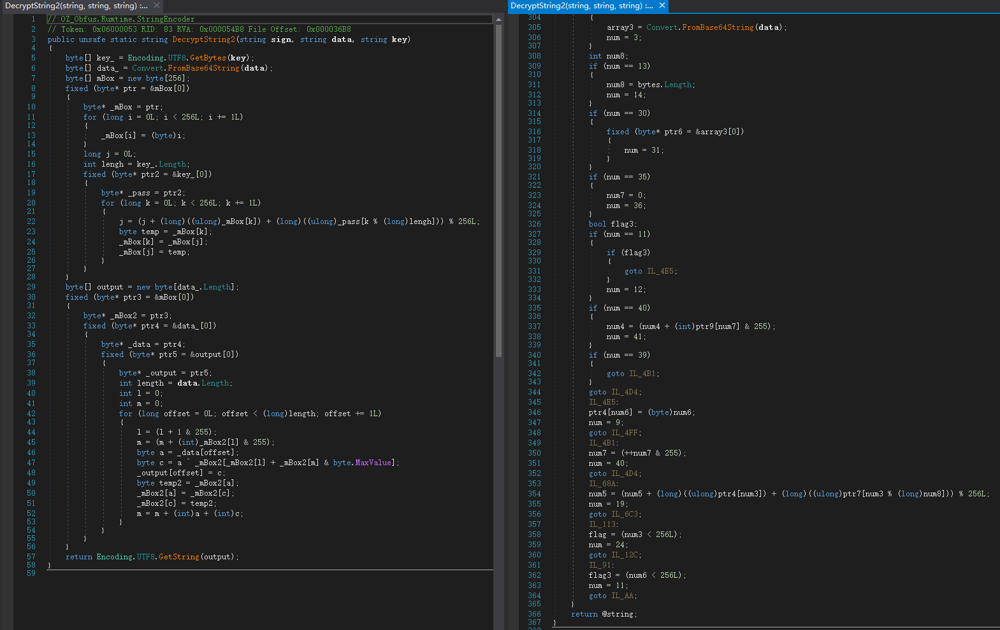
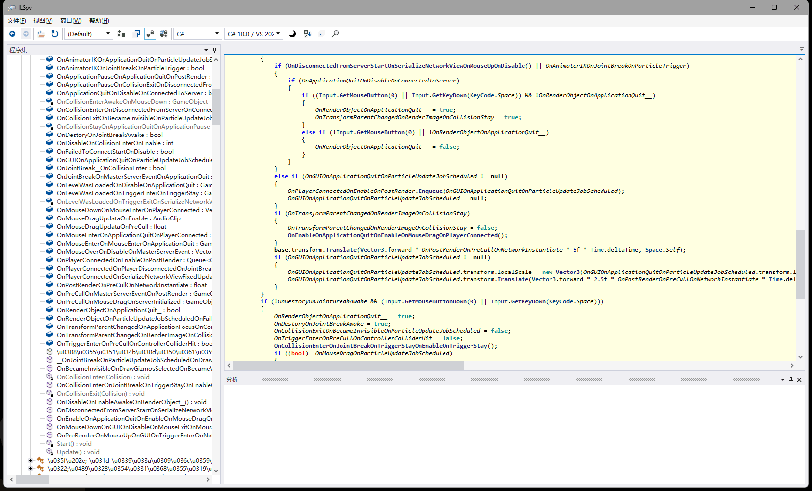

# Ether_Obfuscator

中文版本README请[戳我](README_zh-cn.md)

## Function List

|                       |Description|
|--------------------------|----|
|ControlFlow               |Confusing the execution process |
|NumObfus                  |Obfuscate num|
|LocalVariables2Field      |Convert local variables into fields|
|StringCrypt               |String encryption|
|ObfusFunc                 |Confuse the names of classes, fields, methods and parameters|
|Anti De4dot               |Invalidate De4dot|
|Anti Anti-ILDASM          |Invalidate disassembler|
|PEPacker                  |Removing the NET flag makes ILSpy, DnSpy and other software unable to correctly recognize the NET assembly|
|MethodError               |Break Method makes Dnspy and other decompilers unable to restore C # code|
> You can find out the detailed introduction and usage below
> 
## How to use Ether_Obfuscator

1. Download `UnityPackage`([Click me to download](https://github.com/Z1029-oRangeSumMer/O-Z-IL2CPP/releases)) and import it into your project

2. If you are using it for the first time, please find `Ether-GenerateConfig` on the top of Unity

   

   The plug-in will automatically analyze your project and generate corresponding configuration files. You can manually configure the generated files for a second time

   

3. Open the Enable switch in the Config file and select the function you need in the Obfuscations below([Function introduction](#function-description))
   
   

4. Now you can build your project directly. As usual, our plug-in will help you complete everything automatically

5. If the project is modified subsequently, you can configure it in the Config file
   

## About Automatic Configuration

- **GUIResolver**
  
  `GUI_ Ignore` includes all `GUI` components and `EventSystem` binding methods. If your project changes, you can click the `Analyze All` button to re-analyze your project, and GUI Resolver will automatically analyze all GUI components in your project and generate IgnoreList

- **AnimationResolver**
  
  `Animation_ Ignore` contains the methods bound to all `Animation` components. If your project changes, you can click the `Analyze All` button to reanalyze your project. AnimationResolver will automatically analyze all animation components in your project and generate IgnoreList

- **ReflectionResolver**
  
  `Reflection_ Ignore` contains all possible `Reflections` *(methods, classes, and namespaces)* that we can analyze. You can click the `Analyze All` button to reanalyze your project. ReflectionResolver will automatically analyze all reflections in your assembly and generate IgnoreList

## Rules
  - The classes and methods that directly call C # in the Native layer or send events to C # through the Unity built-in API cannot be confused (most of them are in mobile platforms)
  - Some scripts bound to plug-ins should not be confused, such as xLua and C # scripts bound to it
  - You can put special class names in `Custom_ Ignore_ List`, the plug-in will automatically ignore them
  
  - For the PEPacker function, we currently only provide automatic processing for Mono backend on Windows platform (please manually use the PEPack function to confuse the assembly for Mono backend on Android platform or other platforms，**After replacing the file, don't forget to re sign your APK file**)
   
      > The Android platform needs to decompress the apk first, find the `Assembly-CSharp.dll`, handle it manually, and package your apk again and sign it

       

## How to use deal with problems in `Ether_Obfuscator`

1. There may be a bug in the `ControlFlow` function. If Unity throws an exception, you can try to **close the `ControlFlow` function**
2. If an individual method throws an exception during the IL2CPP construction process

    

    You can add the HandleShoot function to `ignore_ControlFlow_Method`

   

## Function Description
 - ControlFlow

   Using this method will confuse the process of your program function method, without changing the execution process, it can disrupt the compilation process and the order of IL code, and can interfere with the work of the cracker
   

 - NumObfus
  
   Use this method to encrypt all int type preset constants in your assembly
   

 - LocalVariables2Field

   Use this method to convert the local variables of your program's functions into fields, reducing code readability
   

 - StringCrypt

   Use this method to encrypt the string constants in your game. Each string corresponds to a separate password and a separate decryption function, making it more difficult to crack
   

 - ObfusFunc

   Use this method to encrypt all functions, classes, and even parameters in your project to minimize the readability of the program（We use the key function name of Unity as the dictionary, making it difficult to identify the functions confused by this method as Obfuscated or JunkFunc）

   >See the bottom for rules of use

   

 - Anti-De4dot

   Invalidate De4dot

   

 - Anti-ILDASM
   
   Invalidate disassembler

 - PEPacker(only for Mono backend)
   
   Removing the NET flag makes ILSpy, DnSpy and other software unable to correctly recognize the NET assembly

   

 - ErrorMethod
   
   Break Method makes Dnspy and other decompilers unable to restore C # code

   
